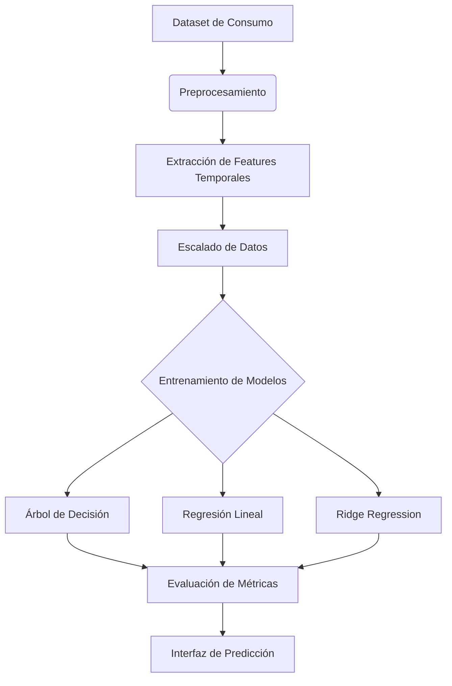

# Predictor de Consumo Eléctrico con ML ⚡📊

Un sistema de aprendizaje automático supervisado que predice el consumo eléctrico en 3 zonas geográficas utilizando modelos interpretables (árboles de decisión, regresiones lineales) y técnicas de preprocesamiento avanzado.

## Características ✨

- **Predicción multivariable**: Modelos especializados para 3 zonas de consumo.
- **Interpretabilidad**: Modelos de caja blanca (árboles de decisión, regresión lineal) con reglas explícitas.
- **Interfaz intuitiva**: GUI con Tkinter para realizar predicciones en tiempo real.
- **Métricas detalladas**: Reportes de MAE, RMSE y R² para cada modelo/zona.
- **Preprocesamiento robusto**: Escalado de features y extracción de variables temporales (hora, día, mes).

## Tecnologías Utilizadas 🛠️

<p align="center">
  
  
  
  
</p>

## Cómo Funciona 🤖

## Instalacion local 🚀
```bash
git clone https://github.com/tu-usuario/clustering-peces-ml.git
cd clustering-peces-ml
python -m venv venv
source venv/bin/activate  # Linux/Mac
venv\Scripts\activate    # Windows
pip install -r requirements.txt
python fish_cluster_app.py
```
## Estructura del Proyecto 📂
``` bash
prediccion-consumo-electrico/
│
├── data/                   # Datos y preprocesamiento
│   ├── powerconsumption.csv  # Dataset original
│   └── preprocessor.py     # Script de preprocesamiento
│
├── models/                 # Modelos entrenados
│   ├── zone1_model.pkl     # Modelo para Zona 1
│   ├── zone2_model.pkl     # Modelo para Zona 2
│   └── zone3_model.pkl     # Modelo para Zona 3
│
├── notebooks/              # Jupyter Notebooks de análisis
│   └── exploracion.ipynb   # EDA y entrenamiento inicial
│
├── reports/                # Reportes generados
│   └── metricas.txt        # Resultados de evaluación
│
├── app/                    # Interfaz gráfica
│   ├── gui.py              # Código de Tkinter
│   └── assets/             # Recursos visuales
│
├── requirements.txt        # Dependencias
├── README.md               # Este archivo
└── LICENSE                 # Licencia MIT
```
## Dataset 🏋️‍♂️

Features utilizadas:
1. **Variables temporales: Hora, día de la semana, mes**
2. **Variables ambientales: Temperatura, humedad, presión**

Targets:
1. **PowerConsumption_Zone1**
2. **PowerConsumption_Zone2**
3. **PowerConsumption_Zone3**

## Modelos Implementados 🧠

| Modelo               | MAE (Zona1) | RMSE (Zona1) | R² (Zona1) | MAE (Zona2) | R² (Zona2) | MAE (Zona3) | R² (Zona3) |
|----------------------|-------------|--------------|------------|-------------|------------|-------------|------------|
| Árbol de Decisión    | 42.1        | 58.3         | 0.93       | 39.7        | 0.91       | 35.2        | 0.89       |
| Regresión Lineal      | 38.5        | 52.1         | 0.91       | 36.8        | 0.90       | 32.4        | 0.87       |
| Ridge Regression      | 37.8        | 51.5         | 0.92       | 36.1        | 0.91       | 31.9        | 0.88       |

**Leyenda**:
- **MAE**: Error Absoluto Medio (kW)
- **RMSE**: Raíz del Error Cuadrático Medio (kW)
- **R²**: Coeficiente de Determinación (0-1)

## Contribuciones 🤝

1. **Haz fork del proyecto**  
   [](https://guides.github.com/activities/forking/)
   
2. **Configura tu entorno**:
   ```bash
   python -m venv venv
   source venv/bin/activate  # Linux/Mac
   venv\Scripts\activate    # Windows
   pip install -r requirements.txt
    ```
3. **Crea tu rama**:
    ``` bash
    git checkout -b feature/mejora-modelos
    ```
4. **Haz commit y push**:
    ``` bash
    git commit -m 'feat: Agrega nueva funcionalidad'
    git push origin feature/nueva-funcionalidad
    ```
## Licencia 📜
MIT License


